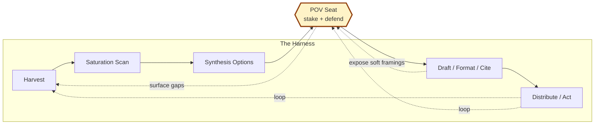
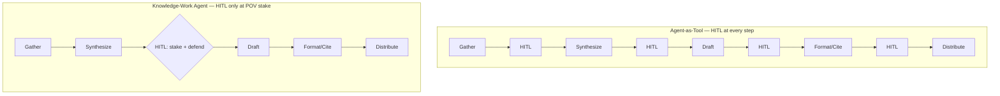

What changes when you treat a knowledge-work agent as Model + Harness + a single human seat for staking a defensible POV into action — and why the harness shape is loops, not pipelines.

---

My cousin Siddharth asked me how to learn robotics faster with AI.

"You can't," I told him. "You're limited by your prefrontal cortex. What you can do is fast-track the workflow."

"What are you doing? Are you learning? Trying to look smart? Trying to engage with someone? That changes the workflow."

The conversation crystallized something I'd been deriving from eight months of building agents — and the past few weeks of building one specifically: a tool I call Conviction Board that maps what I read against my open decisions. Most of what gets called "AI for knowledge work" today — Cursor, Notion AI, Mem — sits at agent-as-tool. It speeds up the scaffolding around knowledge work without changing its shape. There's a different category sitting in the white space, and it's worth defining from first principles.

## A working definition

Viv Trivedy at LangChain has the cleanest framing for what an agent is:

*Agent = Model + Harness. If you're not the model, you're the harness.*

The harness is every piece of code, configuration, and execution logic that wraps the model and turns it into a work engine. Filesystem, bash, sandboxes, memory, hooks — all harness.

A knowledge-work agent needs a third term:

> **Knowledge-Work Agent = Model + Harness + a single human seat where a defensible POV is staked into an action, looped.**
>
> **If you're not the one staking the POV into action, you're the harness.**

Three things that definition is doing that "form a POV" alone wasn't:

- **Defensible.** Not opinion-having. The take has to survive contestation — counter-takes, gaps, missing evidence.
- **Staked into action.** Not preference. The take has to drive a decision — publish, build, refuse, hold.
- **Looped.** Not linear. Each pass through the harness sharpens the take across cycles. Loops compound; pipelines don't.

*The knowledge-work agent harness. The POV seat is the only place HITL sits. Every primitive returns — distribution feeds the next harvest, draft attempts surface POV gaps. Loops are the shape, not a feature.*

## Working backwards from POV-formation

The rest of this post derives the harness components the same way Viv derives them for coding agents — working backwards from desired behavior to the primitive that delivers it.

*Behavior we want → Harness primitive that helps the model deliver it.*

| Behavior we want | Harness primitive |
|---|---|
| Get material at the right altitude | Harvest across the continuum |
| Don't write the saturated take | Saturation / white-space scan |
| Form a defensible POV staked into action | The POV seat (stake + defense) |
| Convert take → published artifact | Execution scaffolding |
| Sharpen everything across cycles | Loop everything |

## Harvest across the continuum

**We want the agent to gather material at the right altitude.**

Source material spans a continuum. At one end: lived experience — your own conversations, build moments, friction. At the other: authority references — Karpathy, Hamel, Viv, named voices. In between: pattern observations and synthesis framings.

Each position carries its own altitude. Pure lived material reads as anecdote. Pure authority reads as aggregation. The take lives in the range.

The harness has to harvest across all four positions and preserve the altitude of each. When harvest collapses — when the agent paraphrases the lived moment, or summarizes the authority quote, or treats them as interchangeable — the artifact reads as a clean monologue stripped of the texture that made the source land.

I learned this drafting this very post. The first version was written without a real harvest step. It read as my conclusion delivered cleanly, with none of the lateral hops that produced the take. Altitude lives in the moves, not the resting place.

## Saturation vs. white-space scan

**We want the agent to skip what's already been said.**

Most output in the "AI for knowledge work" space converges to saturated takes — *AI will replace knowledge workers*, *AI augments knowledge workers*, *use better prompts*. These are the takes the harness has to scan and skip.

A coding-agent harness doesn't need this primitive. The codebase is the ground truth; either the test passes or it doesn't. A knowledge-work agent operates in a discourse, not a codebase. The same take from a saturated voice and from white space lands differently — even when the take is identical.

The primitive: a scan step that takes the candidate take and surfaces where it sits — saturated, known-but-not-saturated, emerging, white space. Skip the saturated. Embed the known-but-not-saturated as scaffolding. Stake the white space as the post.

## The POV seat — stake + defense

**We want the human in the loop at exactly one place: staking a defensible take into an action.**

Karpathy: *"You can outsource inference, you can't outsource understanding."*

That's the wedge. Inference is what the harness does — given material and a prompt, produce an output. Understanding is what the human does — given material and a stake, form a point of view that's contestable, defensible, and yours.

The seat itself has structure. It's not "pick a framing." It's three steps:

1. **Surface** — harness presents 2-3 candidate framings.
2. **Stress-test** — harness classifies incoming material against the chosen stance: *strengthens*, *challenges*, *exposes a gap*. The take has to survive each.
3. **Stake into action** — human commits the take to a downstream act: publish, build, refuse, hold.

Conviction Board, the system I'm building, does step 2 explicitly. Each chunk from Readwise gets classified against an active stance — not by topic match, but by stance-grounded classification. A piece that strengthens the take is reinforcement. One that challenges it is a defensibility test. One that exposes a gap reshapes the take. Without the stance, classification collapses to topic relevance — and the take stops being defensible because nothing tests it.

This is what separates a knowledge-work agent from agent-as-tool. Cursor keeps the human in the loop at every code suggestion. Notion AI keeps the human in the loop at every paragraph. They speed up scaffolding without removing the human from any of it.

A knowledge-work agent does the inverse. It pulls the human out of every scaffolding step and concentrates the human's attention on the one step that doesn't compress — staking a defensible take into an action.

*Same workflow. Different harness shape. Agent-as-tool keeps the human in every step. The knowledge-work agent removes HITL from everything except the POV stake.*

## Execution scaffolding (post-POV)

**We want everything after the take to happen without HITL.**

Once the POV is staked, the rest is mechanical: draft the artifact in the chosen voice, format it for the chosen platform, cite the chosen authorities, distribute on the chosen surface. None of this should require the human to weigh in.

This is where most current "AI for knowledge work" sits — and also where most of it goes wrong. They build great tooling for drafting and formatting, then re-insert HITL at every step. *Does this paragraph look right? Does this citation work?* The human spends their attention budget on scaffolding decisions instead of on the take.

The primitive: a pipeline that runs to completion once the POV is staked, surfacing only true blockers — broken citations, missing facts — not preference checks.

## Loop everything

**We want each pass through the harness to make the take sharper than the last.**

Linear pipelines don't compound. Loops do. Every primitive in the harness has a return arrow:

- Distribution surfaces responses → re-harvest.
- Draft attempts reveal soft framings → re-stake the POV.
- Synthesis options that don't separate cleanly → re-scan saturation.
- Action outcomes that don't land → re-form the take.

The lived example sits in CB's mapping engine. Mapping is the highest-risk reasoning step in the system because it requires judgment — classify chunk against stance as strengthen, challenge, or gap. Misclassification silently corrupts everything downstream. CB wraps the mapping step in an eval loop that hand-labels classifications and calibrates the classifier over time. The eval loop is what makes the mapping primitive actually work.

That's the pattern at the harness level. Every primitive that requires judgment needs a loop that calibrates it — not as a nice-to-have, but as the thing that makes the primitive defensible across cycles.

This is also why the bar shift compounds. A defensible take staked into action that survives ten loops is differently shaped than the same take after one. The take that survives is the one that gets shipped.

## The bar shift

Once the harness is in place, the bar for knowledge work moves.

Before: *how good is your synthesis?*

After: *how good is the take you stake — does it defend against contestation, drive a real action, and survive the loops?*

Synthesis is a solved problem now. The harness handles it. The model produces solid synthesis on demand. POV-formation isn't solved — and the part of POV-formation that's hardest is the part that compounds across loops. That's the part left for the human, and the part that distinguishes one knowledge worker from another.

The job description sharpens. It doesn't go away.

## Open problem

The hardest piece of this is the POV seat itself. Today, harnesses surface synthesis options — three competently-framed versions of the same idea. They don't surface contestable takes the human can stake into.

CB's mapping engine does this for incoming chunks (stance-grounded classification). The next problem is doing it for the synthesis options themselves: surfacing 2-3 framings that *disagree with each other* — not three competent variations of the same view. The human seat then becomes a real choice, not a preference click.

Knowledge work doesn't get replaced. It gets sharper, defensible, looped — and the work is in the loops, not in the take.

---

## Further reading

- Viv Trivedy — [Deriving Agent Harnesses from First Principles](https://x.com/Vtrivedy10/status/2031408954517971368) (the framing this post extends)
- Andrej Karpathy — *"You can outsource inference, you can't outsource understanding."*
- Hamel Husain — domain-expert evaluation as the loop that teaches the model what good looks like (referenced from [[Projects/Skills/Social Presence/Post 3 - Evals Are Teaching/Draft|Post 3]])
- Conviction Board — [[Projects/Skills/Social Presence/Conviction Board/Conviction Board|in build]] (the worked example referenced throughout)
